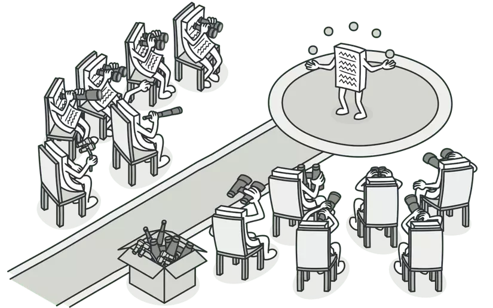

  

## Try Try Try
When designing an app, there is no one way to navigate the process. Every programmer has a different way of thinking and therefore a different method to create. Every programmer follows their own set of design patterns, a way to break down a big design problem into smaller ones in order to come up with a fully functional website.
In my experience, creating a website is extremely difficult if you look at it as one large problem. Not only is it hard, but it is also extremely overwhelming. Having design patterns makes the process much more tangible and can allow you to analyze every part with higher detail, so a better solution is found!

## Guess and Check
Truth be told, I am an easily overwhelmed person, so initially, the thought of creating a whole website on my own was terrifying. However, the process has taught me so much in terms of breaking down problems.
During the process of creating my final project for ICS314 (Manoa Melody), I learned that I find it much easier to design things when I break them down into individual pages and components. When it comes to each page and component, I try to design them from the point of view of the user. Above all, I want the website to be easy and enjoyable to use, so thinking from this POV allows me to cater to them. Creating the NavBar, Footer, and components that we reused multiple times was simple enough, and if we ever thought of improvements, we would implement them afterward. Nothing we create is ever set in stone, everything can be easily improved and that allows us to be constantly doing better.

Overall, there is no right or wrong way to design a website, but it takes a bit of time for each programmer to figure out what works best for them. I know that my way of navigating this process works for me, but I figure that the process itself will change over time and improve! 
