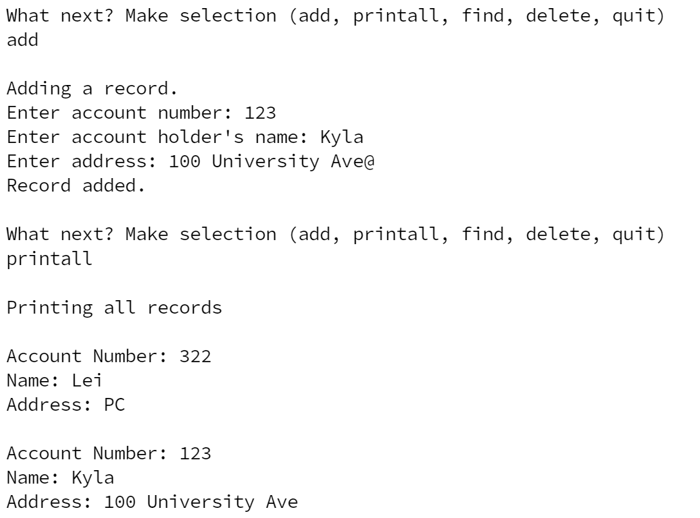

  

This Bank Database was a small project that I completed for my ICS 212 class in Fall 2022. This class focused on learning C and C++, a language I hadn't touched before. This program stores bank records which store a user's name, account number, and address. Records can be added, deleted, or searched for through the command line, similar to how an actual bank database might access customer data.

Prior to this class, I had no knowledge of C or C++ and this project really tested my skills and patience. This project encapsuled all the knowledge that I gained throughout ICS 212 and although it looks simple, it took many many hours to finish. I learned that coding with C is extremely tricky and attention to detail is very important, a simple missing semicolon can cause the entire program to spaz out. Also, dealing with user inputs was very difficult because of possible errors in type differences as well as dealing with incorrectly formatted user input. Lastly, I learned how to read files and how to correctly convert it into usable data, as well as write files to keep the database updated.

Source: <a href="https://github.com/destinyshishido/ics212_bank">Bank Database</a>
