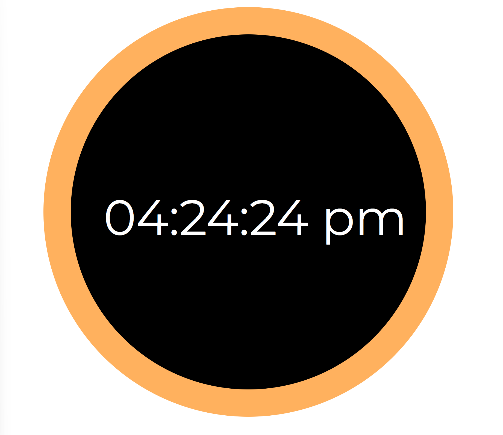

This was the first project that I did in high school that used JavaScript! It is a very simple project but holds a special place in my heart, as it was one of the first times where I realized how much I enjoyed coding.

Source: <a href="https://destinyshishido.github.io/digital-clock/">Digital Clock</a>
