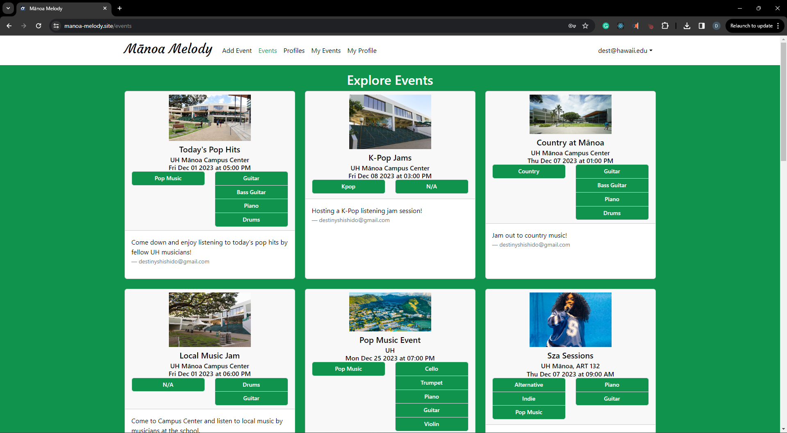
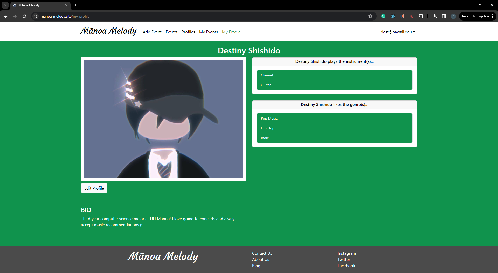

  

Manoa Melody is a web application for the University of Hawaii at Manoa students to form connections based on music, instrument, and genre interests. 

  

 ## Contributions
The group as a whole brainstormed the idea of the app along with the pages that we wanted to implement. I was able to contribute to this project by creating and designing the Explore Profiles page
 
<a href="">Visit Manoa Melody!</a>
<a href="">Manoa Melody Home Page</a>
<a href="">Manoa Melody GitHub Organization</a>
